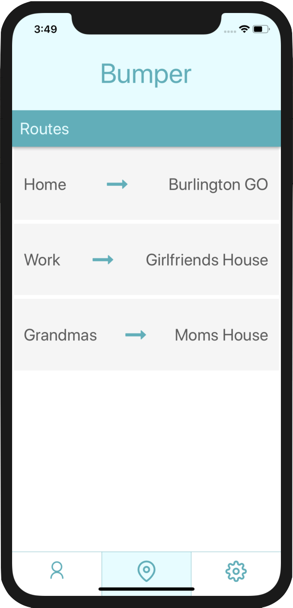

<!-- PROJECT LOGO -->
<br />
<p align="center">
    
</p>


# Bumper

## Table of Contents
+ [About](#about)
+ [Built With](#built_with)
+ [Getting Started](#getting_started)

## About <a name = "about"></a>
Every morning I wake up 40 minutes earlier than when I have to actually wake up. I do this because I need to make sure there isn't traffic on my commute to work, which is painful because I have to enter my route into Google Maps. The idea for this app is to have a simple interface to refresh common routes, and have quick realtime traffic data display so that this process is simplified. Unfortunately there is no free API that provides end-to-end ETA's while taking traffic into consideration, so I'm currently trying to figure out a workaround. Stay tuned.


## Built With <a name = "built_with"></a>
* [React-Native](https://facebook.github.io/react-native/)

## Getting Started <a name = "getting_started"></a>
These instructions will get you a copy of the project up and running on your local machine for development and testing purposes.

### Prerequisites

Make sure you have npm installed as well as expo. Then run:

```
npm install
expo start
```
